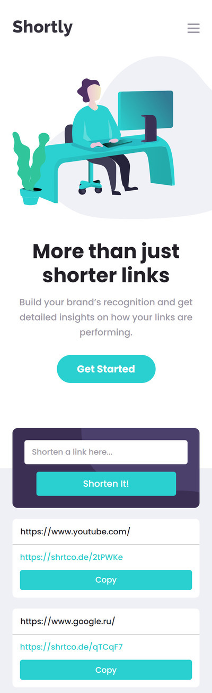

# Frontend Mentor - Shortly URL shortening API Challenge solution

This is a solution to the [Shortly URL shortening API Challenge challenge on Frontend Mentor](https://www.frontendmentor.io/challenges/url-shortening-api-landing-page-2ce3ob-G).

## Overview

### The challenge

Users should be able to:

- View the optimal layout for the site depending on their device's screen size
- Shorten any valid URL
- See a list of their shortened links, even after refreshing the browser
- Copy the shortened link to their clipboard in a single click
- Receive an error message when the `form` is submitted if:
  - The `input` field is empty

### Links

- [Solution URL:]([https://github.com/EvgiSs/shortening-url-api/tree/main))
- [Live Site URL:](https://evgiss.github.io/shortening-url-api/)

### Screenshot

  &nbsp;&nbsp;

## My process

### Built with

- Semantic HTML5 markup
- SCSS
- Flexbox
- Mobile-first workflow
- [Vue3](https://v3.ru.vuejs.org/) - Composition API
- [vue-clipboard3](https://github.com/JamieCurnow/vue-clipboard3) - vue library
- [Vue3 Smooth Scroll](https://github.com/laineus/vue3-smooth-scroll) - vue library

### What I learned

app development with Vue3, Composition API

## Author

- Website - [EvgiSs](https://github.com/EvgiSs)
- Frontend Mentor - [@Evgi](https://www.frontendmentor.io/profile/EvgiSs)
